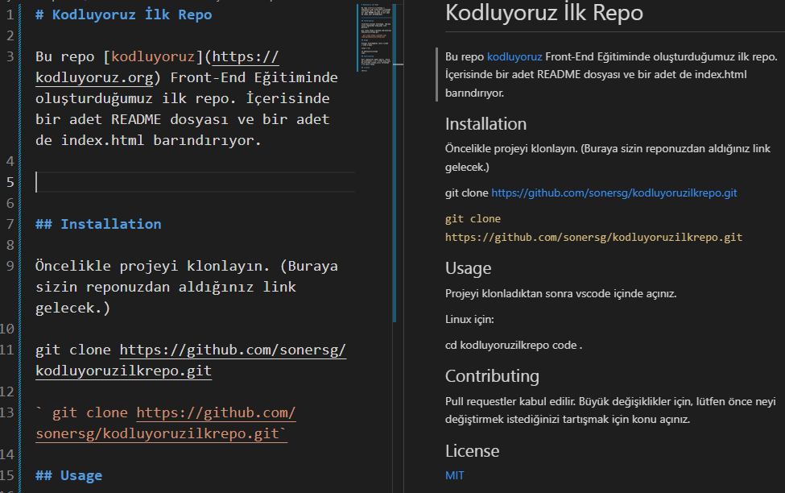

# Kodluyoruz İlk Repo

Bu repo [kodluyoruz](https://kodluyoruz.org) Front-End Eğitiminde oluşturduğumuz ilk repo. İçerisinde bir adet README dosyası ve bir adet de index.html barındırıyor.

## Installation

Öncelikle projeyi klonlayın. (Buraya sizin reponuzdan aldığınız link gelecek.)

git clone https://github.com/sonersg/kodluyoruzilkrepo.git

` git clone https://github.com/sonersg/kodluyoruzilkrepo.git`

## Usage

Projeyi klonladıktan sonra vscode içinde açınız.

Linux için:

cd kodluyoruzilkrepo
code .

## Contributing

Pull requestler kabul edilir. Büyük değişiklikler için, lütfen önce neyi değiştirmek istediğinizi tartışmak için konu açınız.

## License

[MIT]()

